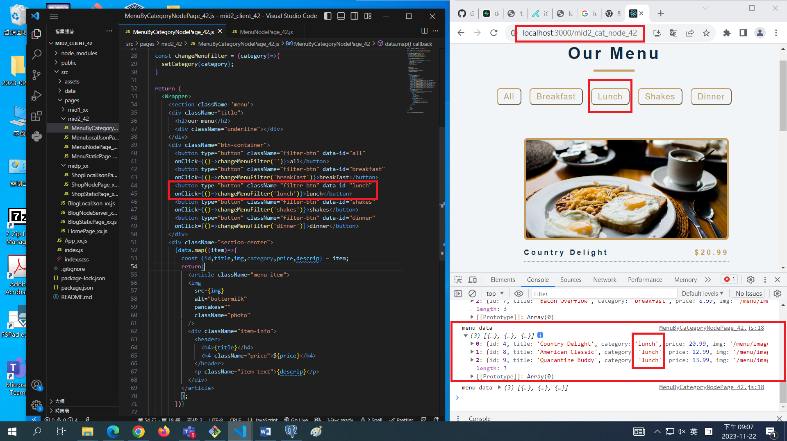
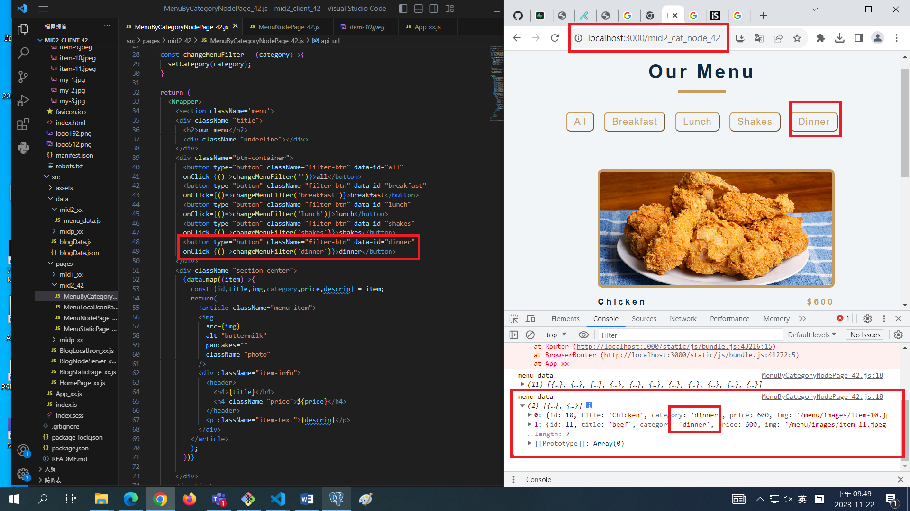

[My Github Repo URL](https://github.com/George0113/1121-wp1-demo-211410542.git)

### W11-P1: implement /api/mid2_xx/menu_xx/:category


```
f5ad51c George0113      Wed Nov 22 19:50:50 2023 +0800  W11-P1: implement /api/mid2_xx/menu_xx/:category
```

### W11-P2: implement /mid2_node_xx in React to get menu data from Node server


```
9c5c7e7 George0113      Wed Nov 22 21:15:09 2023 +0800  W11-P2: implement /mid2_node_xx in React to get menu data from Node server
```

### W11-P3: implement /mid2_cat_node_xx in React to get category data from Node server





```
c2d9cc5 George0113      Wed Nov 22 21:17:00 2023 +0800  W11-P3: implement /mid2_cat_node_xx in React to get category data from Node server
```

### W11-P4: Create two menu data with category 'dinner', and get these two data from React 'Dinner' button

#### => in pgAdmin, show two newly added data


#### => in React, show two newly added data by pressing Dinner button



```
d28da26 George0113      Wed Nov 22 21:53:45 2023 +0800  W11-P4: Create two menu data with category 'dinner', and get these two data from React 'Dinner' button
```

### W011-P5: W11 all logs


```
$ git log --pretty=format:"%h%x09%an%x09%ad%x09%s" --after="2023-11-21"
d28da26 George0113      Wed Nov 22 21:53:45 2023 +0800  W11-P4: Create two menu data with category 'dinner', and get these two data from React 'Dinner' button
c2d9cc5 George0113      Wed Nov 22 21:17:00 2023 +0800  W11-P3: implement /mid2_cat_node_xx in React to get category data from Node server
9c5c7e7 George0113      Wed Nov 22 21:15:09 2023 +0800  W11-P2: implement /mid2_node_xx in React to get menu data from Node server
f5ad51c George0113      Wed Nov 22 19:50:50 2023 +0800  W11-P1: implement /api/mid2_xx/menu_xx/:category
62d96c1 George0113      Wed Nov 22 18:23:53 2023 +0800  w11

```
