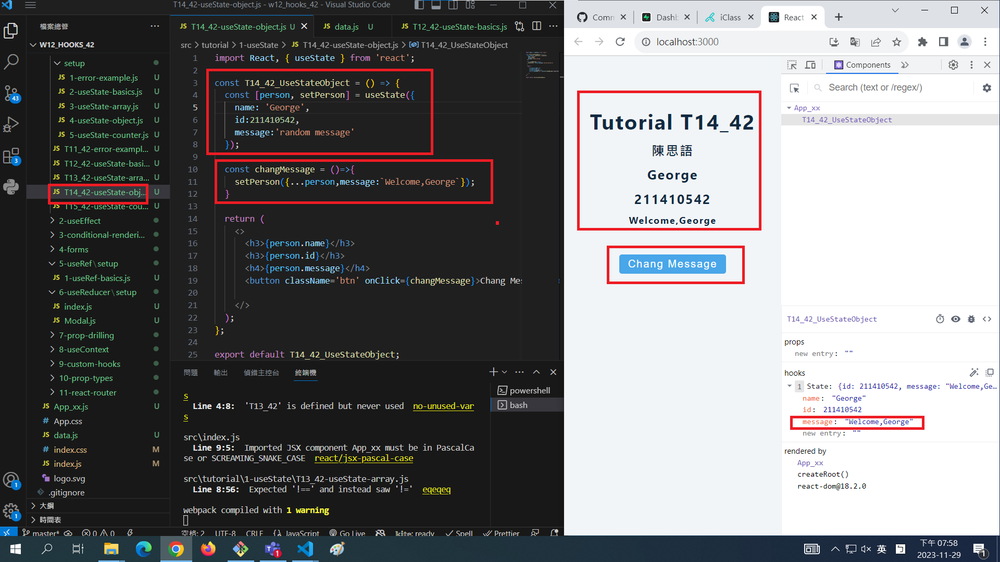

[My Github Repo URL](https://github.com/George0113/1121-wp1-demo-211410542.git)

### W12-P1: Do advanced hooks: T11_xx & T12_xx


```
24fa1f5 George0113      Wed Nov 29 19:09:54 2023 +0800  W12-P1: Do advanced hooks: T11_xx & T12_xx
```

### W12-P2: Do T13_xx using array


```
e25f932 George0113      Wed Nov 29 19:35:36 2023 +0800  W12-P2: Do T13_xx using array
```

### W12-P3: Do T14_xx object



```
9eb69f6 George0113      Wed Nov 29 20:00:50 2023 +0800  W12-P3: Do T14_xx object
```

### W12-P4: Do T23_xx ,fetch Github using useEffect


```
8d579d8 George0113      Wed Nov 29 20:53:27 2023 +0800  W12-P4: Do T23_xx ,fetch Github using useEffect
```

### W012-P5: W12 all logs


```
$ git log --pretty=format:"%h%x09%an%x09%ad%x09%s" --after="2023-11-28"
31b5ffe George0113      Wed Nov 29 21:01:08 2023 +0800  W012-P5: W12 all logs
8d579d8 George0113      Wed Nov 29 20:53:27 2023 +0800  W12-P4: Do T23_xx ,fetch Github using useEffect
9eb69f6 George0113      Wed Nov 29 20:00:50 2023 +0800  W12-P3: Do T14_xx object
e25f932 George0113      Wed Nov 29 19:35:36 2023 +0800  W12-P2: Do T13_xx using array
24fa1f5 George0113      Wed Nov 29 19:09:54 2023 +0800  W12-P1: Do advanced hooks: T11_xx & T12_xx
2372d54 George0113      Wed Nov 29 18:18:25 2023 +0800  w12

```
