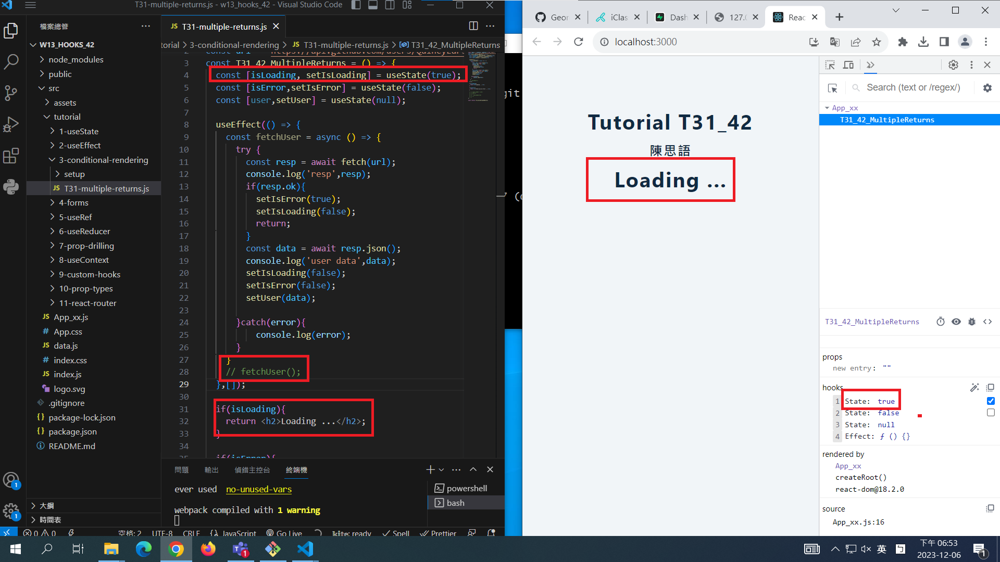
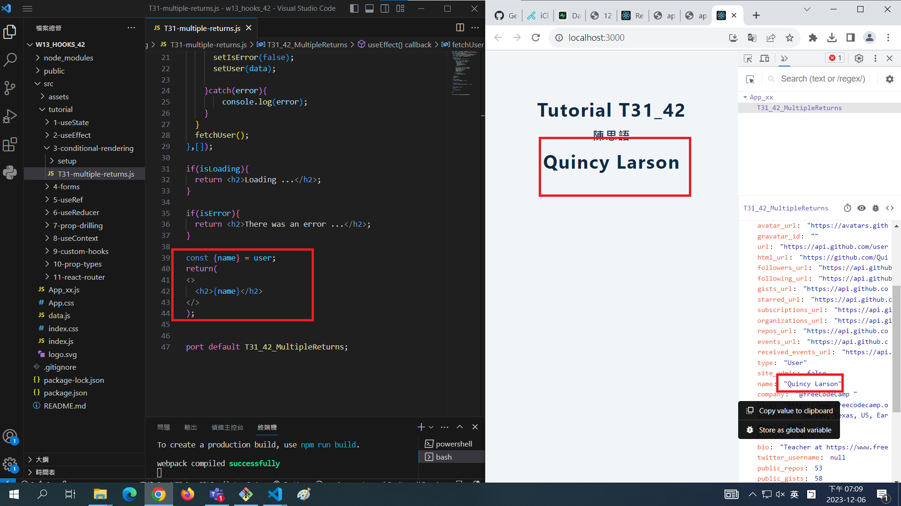
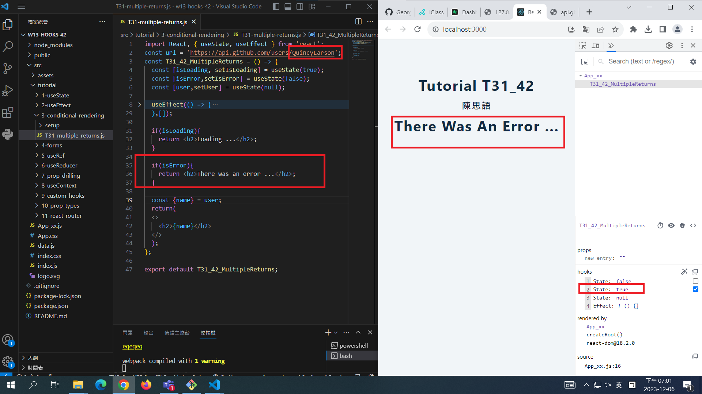
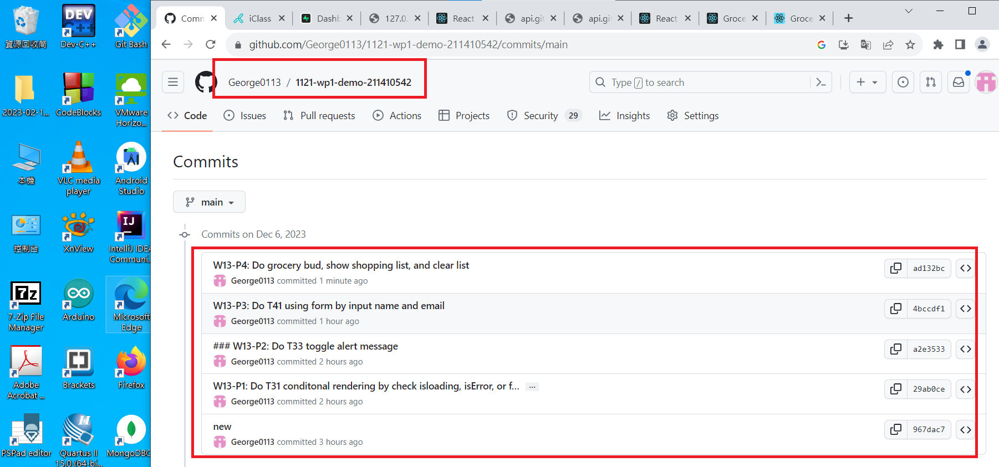

[My Github Repo URL](https://github.com/George0113/1121-wp1-demo-211410542.git)

### W13-P1: Do T31 conditonal rendering by check isloading, isError, or fetch user data correctly





```

```

### W013-P5: W13 all logs



```
$ git log --pretty=format:"%h%x09%an%x09%ad%x09%s" --after="2023-12-07"

```
