[My Github Repo URL](https://github.com/George0113/1121-wp1-demo-211410542.git)

### W15-P1: Do T81_xx, using context to solve prop drilling of T71_xx

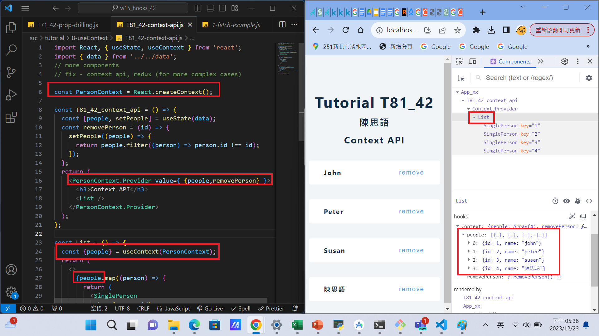
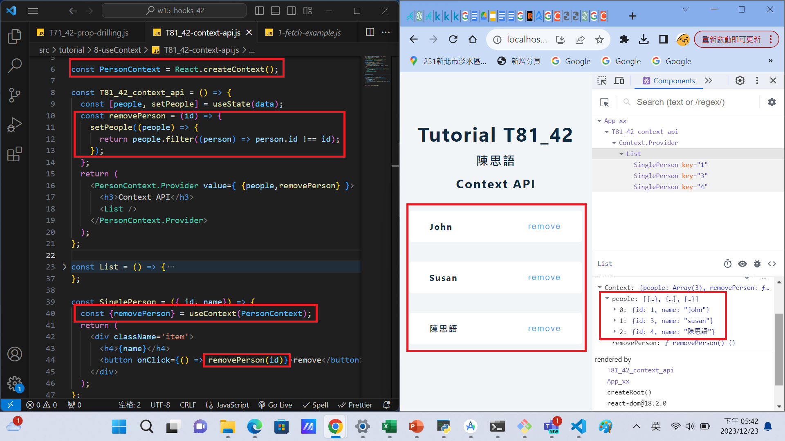

```
f256b76 George0113      Sat Dec 23 17:44:57 2023 +0800  W15-P1: Do T81_xx, using context to solve prop drilling of T71_xx
```

### W15-P2: implement Alert_xx using BlogContext provider

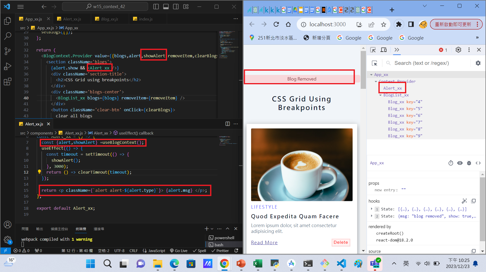

```
2993b5b George0113      Sat Dec 23 22:29:12 2023 +0800  W15-P2: implement Alert_xx using BlogContext provider
```

### W15-P3: Implement BlogList_xx and Blog_xx from BlogContext provider

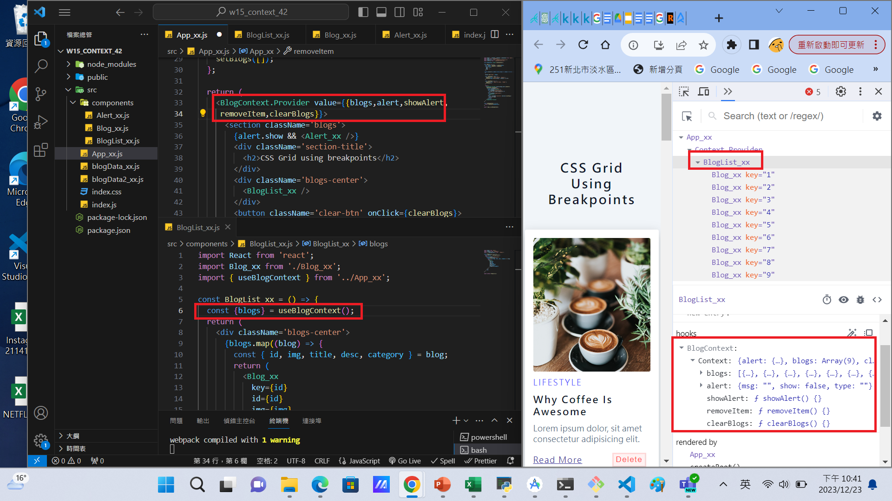

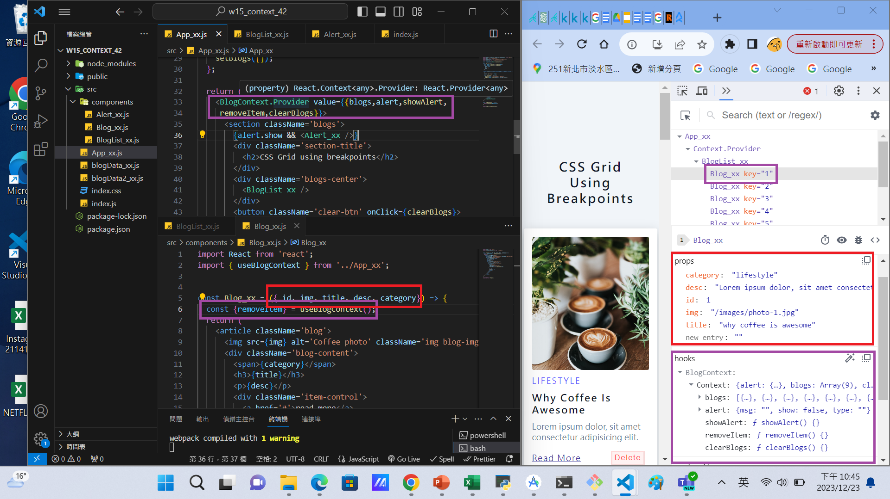

```
e87ba91 George0113      Sat Dec 23 22:48:06 2023 +0800  W15-P3: Implement BlogList_xx and Blog_xx from BlogContext provider
```

### W15-P4: Refine BlogContext in more general form

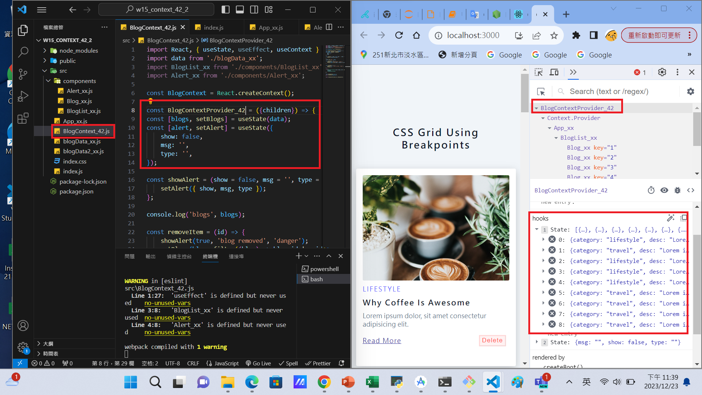

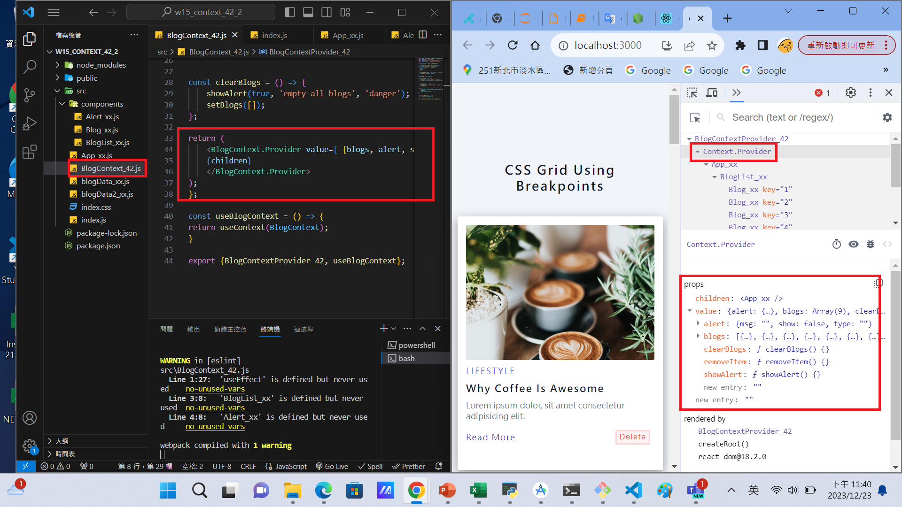

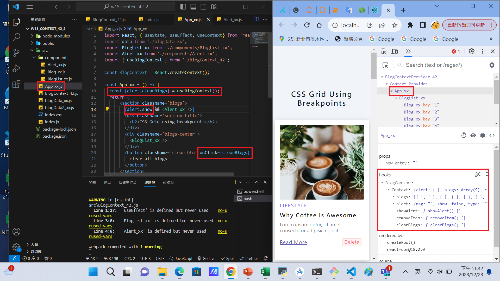

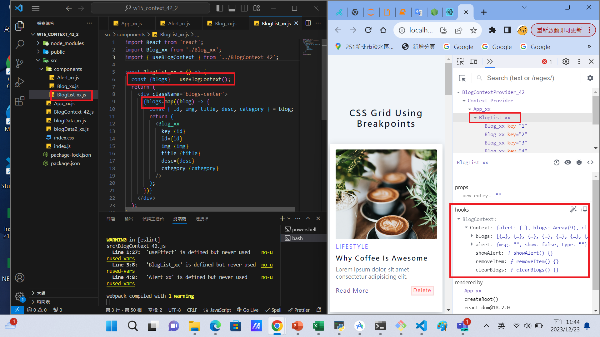

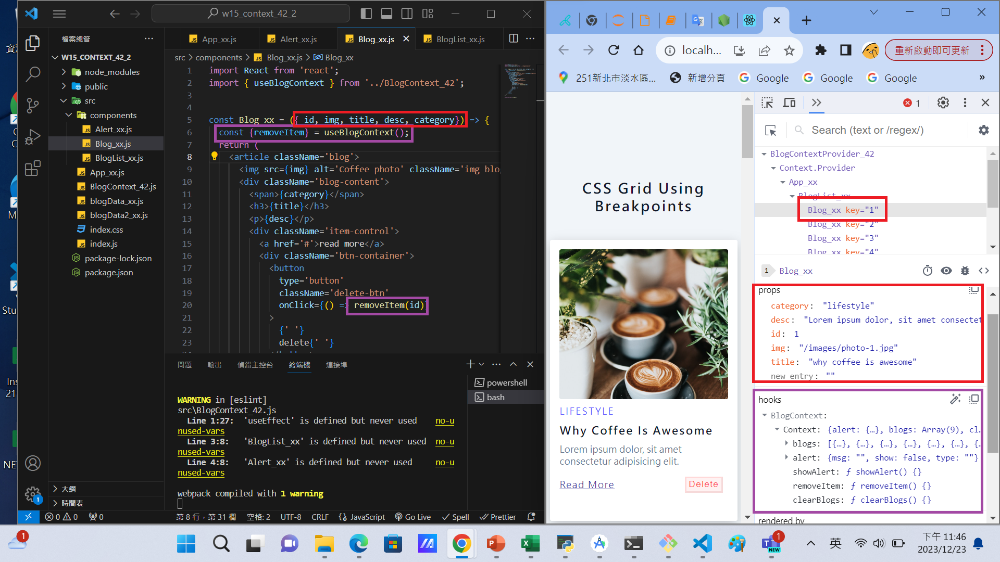

```

```

### W015-P5: W14 all logs

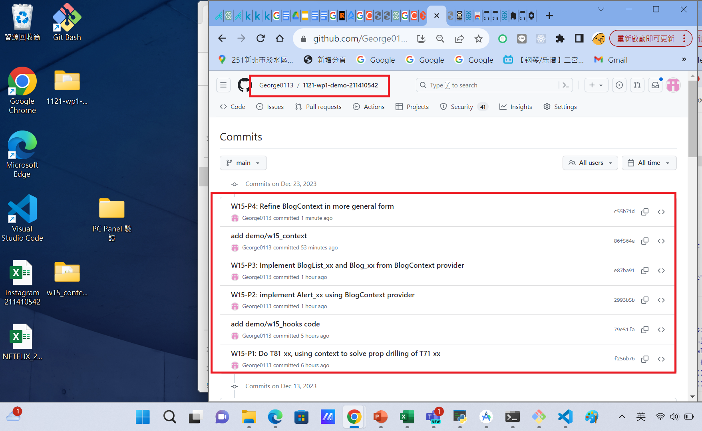

```
$ git log --pretty=format:"%h%x09%an%x09%ad%x09%s" --after="2023-12-12"
810b815 George0113      Wed Dec 13 21:26:46 2023 +0800  W14-P3:W14 all logs
6c7f620 George0113      Wed Dec 13 20:25:07 2023 +0800  W14-P2: implement removeItem
b57c538 George0113      Wed Dec 13 19:41:39 2023 +0800  W14-P1: Store shopping list in local storage
e35dc60 George0113      Wed Dec 13 18:14:33 2023 +0800  w14
```
