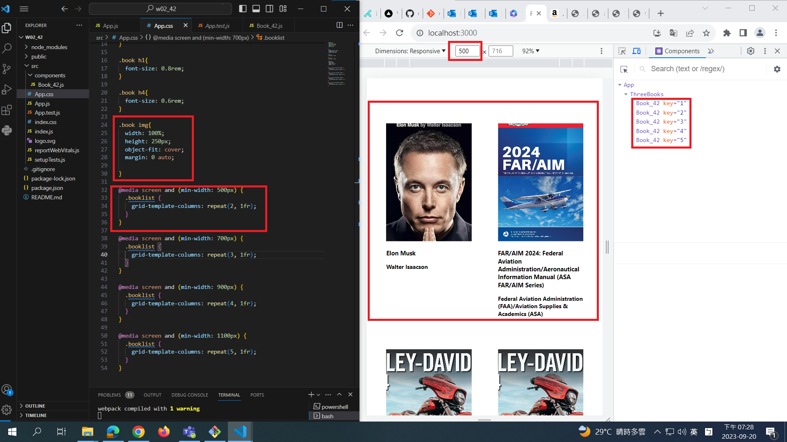
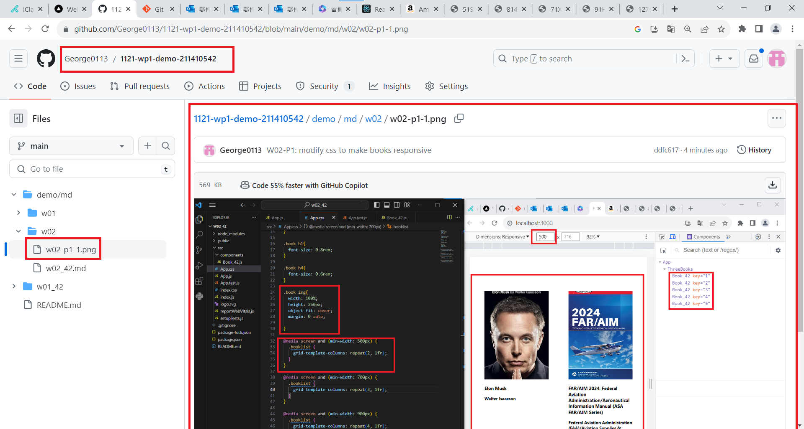
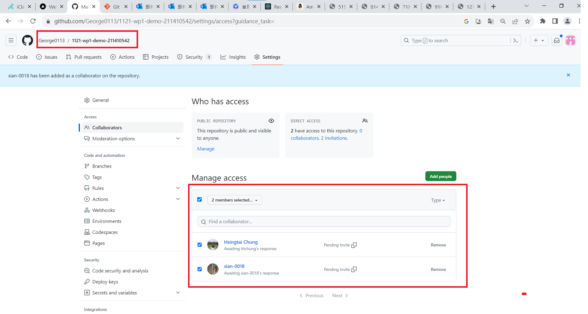
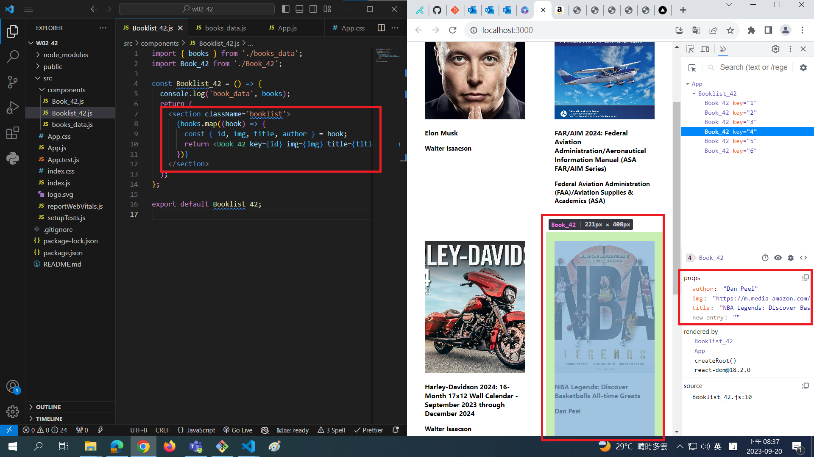
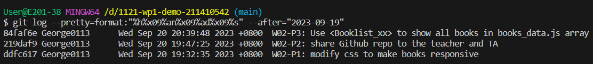

[My Github Repo URL](https://github.com/George0113/1121-wp1-demo-211410542.git)

### W02-P1: modify css to make books responsive




```
ddfc617 George0113      Wed Sep 20 19:32:35 2023 +0800  W02-P1: modify css to make books responsive
```

### W02-P2: share Github repo to the teacher and TA



```
219daf9 George0113      Wed Sep 20 19:47:25 2023 +0800  W02-P2: share Github repo to the teacher and TA
```

### W02-P3: Use <Booklist_xx> to show all books in books_data.js array



```
84faf6e George0113      Wed Sep 20 20:39:48 2023 +0800  W02-P3: Use <Booklist_xx> to show all books in books_data.js array
```

### W02-logs



```
$ git log --pretty=format:"%h%x09%an%x09%ad%x09%s" --after="2023-09-19"
84faf6e George0113      Wed Sep 20 20:39:48 2023 +0800  W02-P3: Use <Booklist_xx> to show all books in books_data.js array
219daf9 George0113      Wed Sep 20 19:47:25 2023 +0800  W02-P2: share Github repo to the teacher and TA
ddfc617 George0113      Wed Sep 20 19:32:35 2023 +0800  W02-P1: modify css to make books responsive
```

1111
