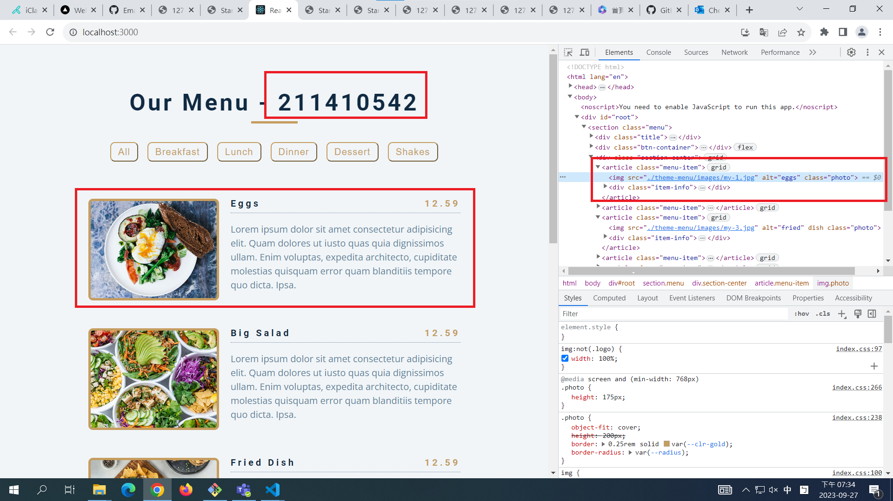
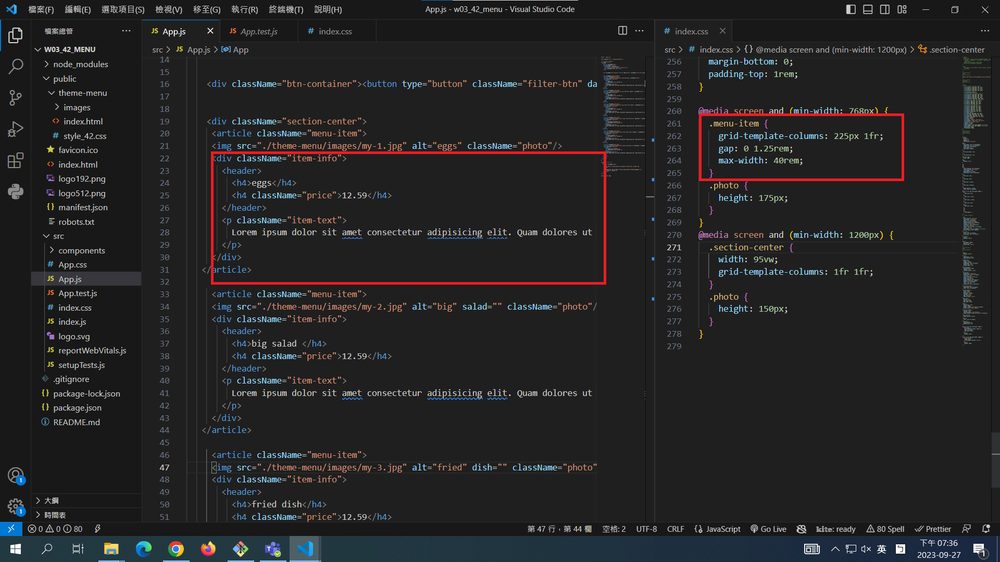

[My Github Repo URL](https://github.com/George0113/1121-wp1-demo-211410542.git)

### W03-P1: Display all static menus in App.js




```
ddfc617 George0113      Wed Sep 20 19:32:35 2023 +0800  W02-P1: modify css to make books responsive
```

```
$ git log --pretty=format:"%h%x09%an%x09%ad%x09%s" --after="2023-09-26"
48add03 George0113      Wed Sep 20 21:30:29 2023 +0800  W02-P4: Use useState hook to store all books in books_data.js array
61749ed George0113      Wed Sep 20 21:02:27 2023 +0800  w02_42
b700cb7 George0113      Wed Sep 20 20:53:38 2023 +0800  W02-logs
84faf6e George0113      Wed Sep 20 20:39:48 2023 +0800  W02-P3: Use <Booklist_xx> to show all books in books_data.js array
219daf9 George0113      Wed Sep 20 19:47:25 2023 +0800  W02-P2: share Github repo to the teacher and TA
ddfc617 George0113      Wed Sep 20 19:32:35 2023 +0800  W02-P1: modify css to make books responsive
```
