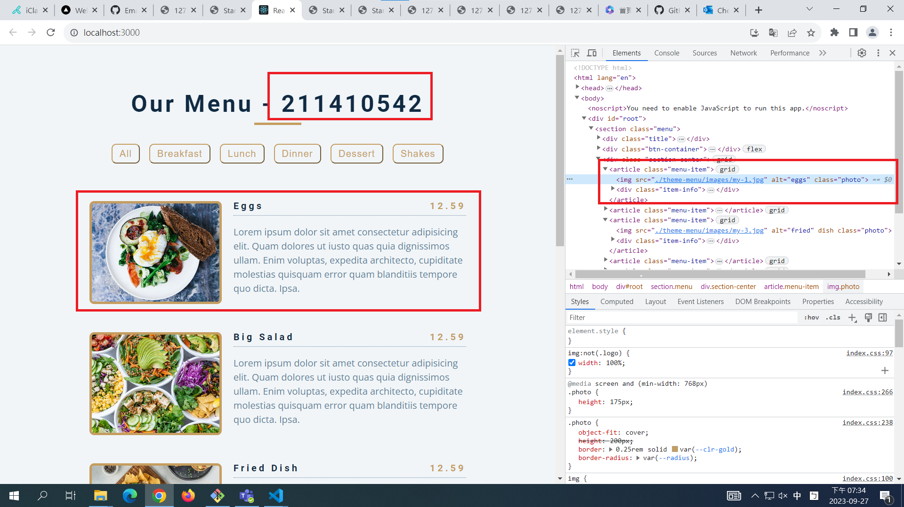

[My Github Repo URL](https://github.com/George0113/1121-wp1-demo-211410542.git)

### W03-P1: Display all static menus in App.js




```
8350f82 George0113      Wed Sep 27 19:39:58 2023 +0800  W03-P1: Display all static menus in App.js
```

```
$ git log --pretty=format:"%h%x09%an%x09%ad%x09%s" --after="2023-09-26"
c74008c George0113      Wed Sep 27 21:32:48 2023 +0800  W03-P4: Display all category buttons from <Category_xx />
62e9ad0 George0113      Wed Sep 27 20:45:09 2023 +0800  W03-P3: Display all menu from <Menu_xx />
e5d6d91 George0113      Wed Sep 27 20:43:50 2023 +0800  W03-P3: Display all menu from <Menu_xx />01
15cf95a George0113      Wed Sep 27 20:10:43 2023 +0800  W03-P2: Display all menu from an array data.js
412e466 George0113      Wed Sep 27 19:45:18 2023 +0800  W03-P1: Display all static menus in App.js
8350f82 George0113      Wed Sep 27 19:39:58 2023 +0800  W03-P1: Display all static menus in App.js
95e3edd George0113      Wed Sep 27 19:38:18 2023 +0800  new
815d57a George0113      Wed Sep 27 18:18:22 2023 +0800  new
```
