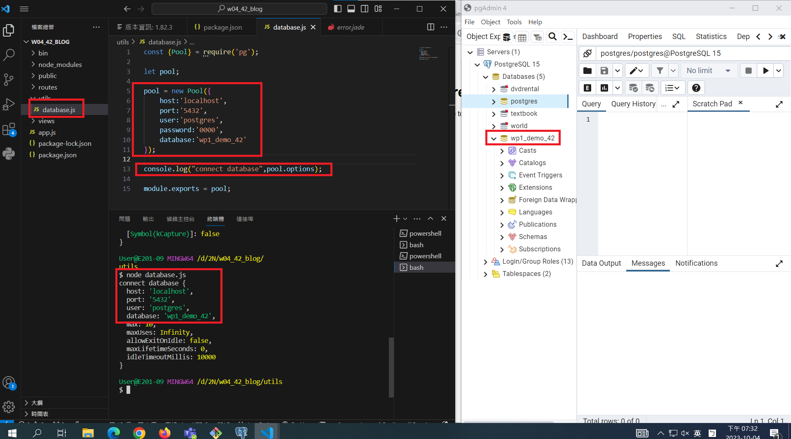
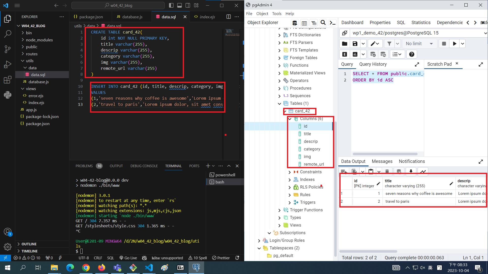
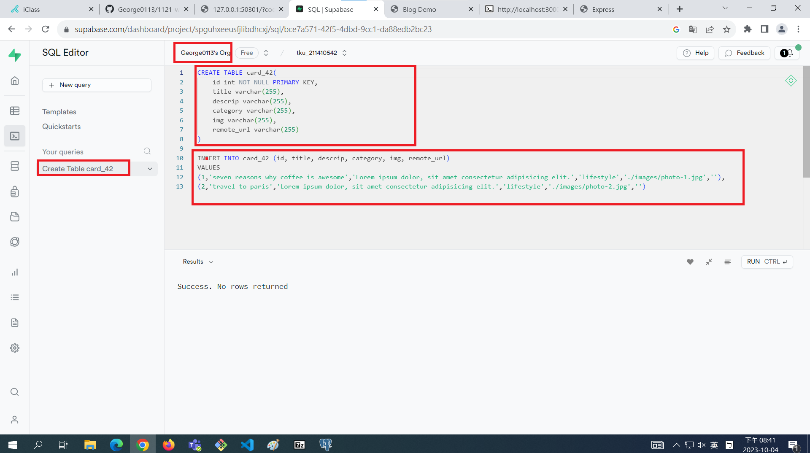
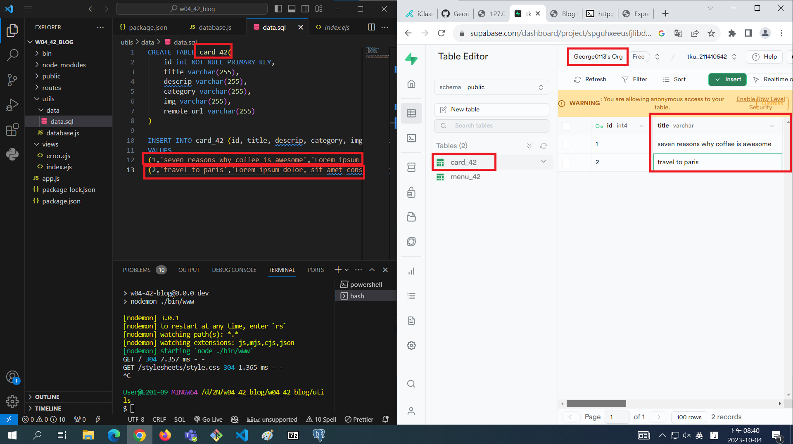

[My Github Repo URL](https://github.com/George0113/1121-wp1-demo-211410542.git)

### W04-P1: Connect database wp1_demo_xx



```
10a60b5 George0113      Wed Oct 4 19:39:24 2023 +0800   W04-P1: Connect database wp1_demo_xx
```

### W04-P2: Using SQL to create table card_xx, and insert two data



```
34f325c George0113      Wed Oct 4 20:34:58 2023 +0800   W04-P2: Using SQL to create table card_xx, and insert two data
```

### W04-P3: Using Supabase SQL editor to create table card_xx, and insert two data





```
$ git log --pretty=format:"%h%x09%an%x09%ad%x09%s" --after="2023-10-03"

```
