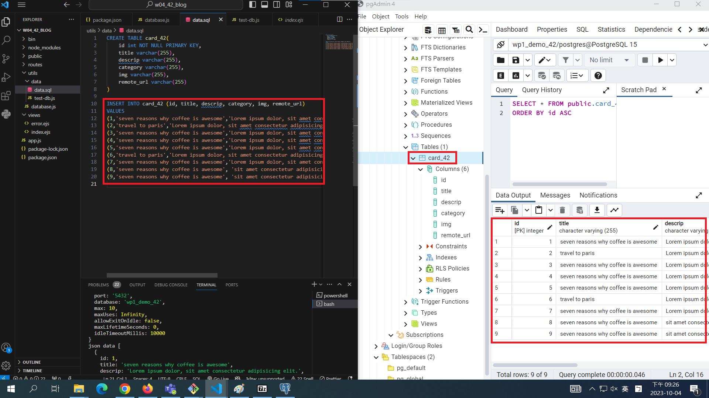
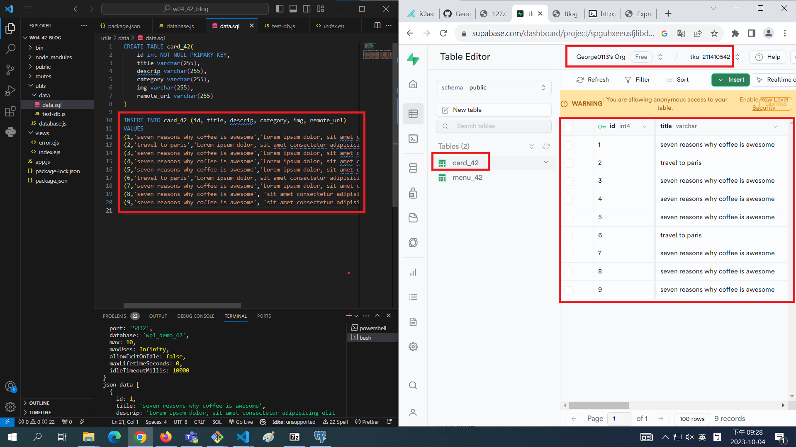
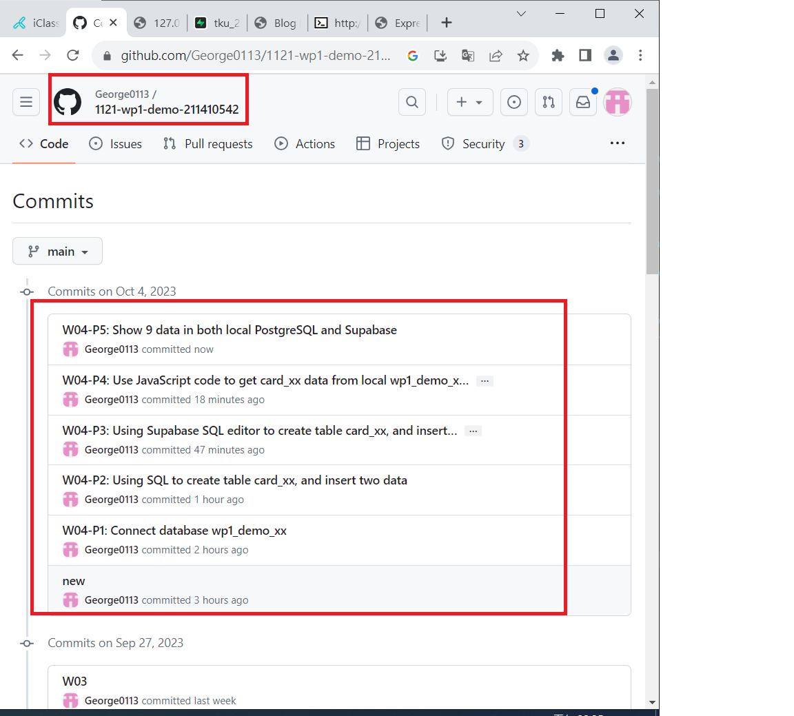

[My Github Repo URL](https://github.com/George0113/1121-wp1-demo-211410542.git)

### W04-P1: Connect database wp1_demo_xx


```
10a60b5 George0113      Wed Oct 4 19:39:24 2023 +0800   W04-P1: Connect database wp1_demo_xx
```

### W04-P2: Using SQL to create table card_xx, and insert two data


```
34f325c George0113      Wed Oct 4 20:34:58 2023 +0800   W04-P2: Using SQL to create table card_xx, and insert two data
```

### W04-P3: Using Supabase SQL editor to create table card_xx, and insert two data


```
314d83a George0113      Wed Oct 4 20:48:18 2023 +0800   W04-P3: Using Supabase SQL editor to create table card_xx, and insert two data
```

### W04-P4: Use JavaScript code to get card_xx data from local wp1_demo_xx database


```
ca5d873 George0113      Wed Oct 4 21:17:26 2023 +0800   W04-P4: Use JavaScript code to get card_xx data from local wp1_demo_xx database
```

### W04-P5: Show 9 data in both local PostgreSQL and Supabase

#### local PostgreSQL



#### Supabase



### W04-P6: W4 all logs



```
$ git log --pretty=format:"%h%x09%an%x09%ad%x09%s" --after="2023-10-03"
e995e04 George0113      Wed Oct 4 21:35:04 2023 +0800   W04-P5: Show 9 data in both local PostgreSQL and Supabase
ca5d873 George0113      Wed Oct 4 21:17:26 2023 +0800   W04-P4: Use JavaScript code to get card_xx data from local wp1_demo_xx database
314d83a George0113      Wed Oct 4 20:48:18 2023 +0800   W04-P3: Using Supabase SQL editor to create table card_xx, and insert two data
34f325c George0113      Wed Oct 4 20:34:58 2023 +0800   W04-P2: Using SQL to create table card_xx, and insert two data
10a60b5 George0113      Wed Oct 4 19:39:24 2023 +0800   W04-P1: Connect database wp1_demo_xx
bc6a468 George0113      Wed Oct 4 18:21:34 2023 +0800   new

```
