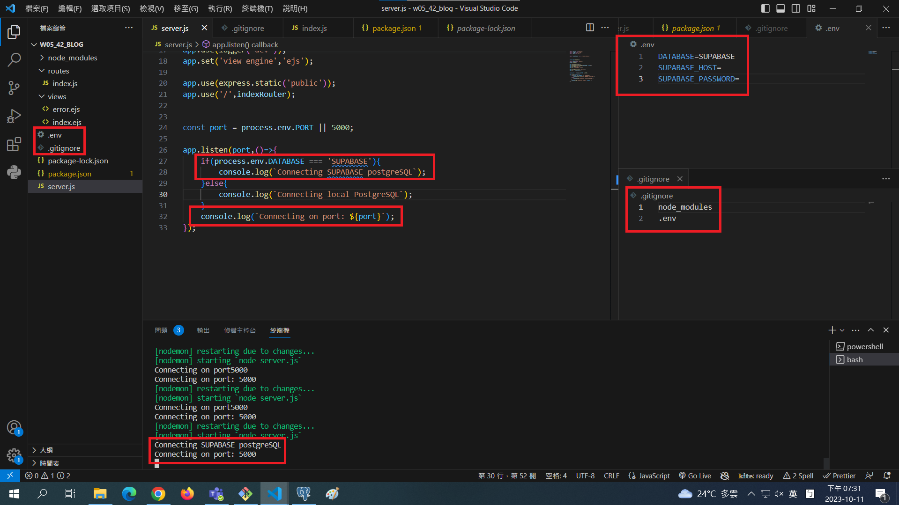

[My Github Repo URL](https://github.com/George0113/1121-wp1-demo-211410542.git)

### W05-P1: Demo how to use environment variable DATABASE



```
10a60b5 George0113      Wed Oct 4 19:39:24 2023 +0800   W04-P1: Connect database wp1_demo_xx
```

### W05-P6: W5 all logs


```
$ git log --pretty=format:"%h%x09%an%x09%ad%x09%s" --after="2023-10-10"

```
