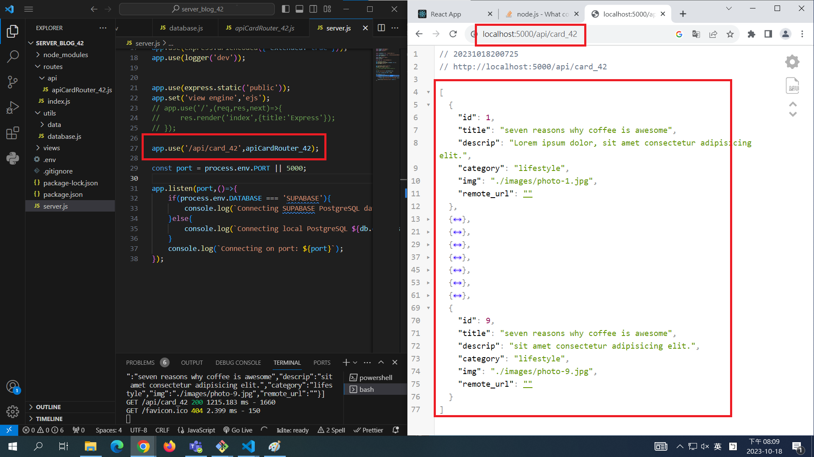
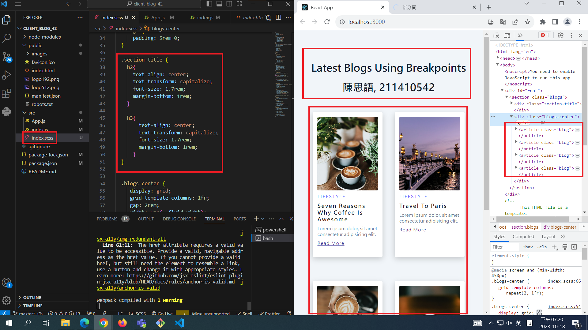

[My Github Repo URL](https://github.com/George0113/1121-wp1-demo-211410542.git)

### W06-P1: Run the server in W5 using /api/card_xx



### W06-P2: blog html theme convert to React using scss



### W05-P5: W5 all logs


```
$ git log --pretty=format:"%h%x09%an%x09%ad%x09%s" --after="2023-10-10"
7d36b56 George0113      Wed Oct 11 21:51:15 2023 +0800  W05-P4: For route /api/card_xx, get Json data from Supabase
e829ed0 George0113      Wed Oct 11 20:54:32 2023 +0800  W05-P3: Using database.js to connect to Supabase and show card_xx data
ac1d370 George0113      Wed Oct 11 19:54:39 2023 +0800  W05-P2: Using pgAdmin 4 to get table card_xx from Supabase
bb671f4 George0113      Wed Oct 11 19:34:38 2023 +0800  W05-P1: Demo how to use environment variable DATABASE
0ff746d George0113      Wed Oct 11 18:15:59 2023 +0800  new
```
