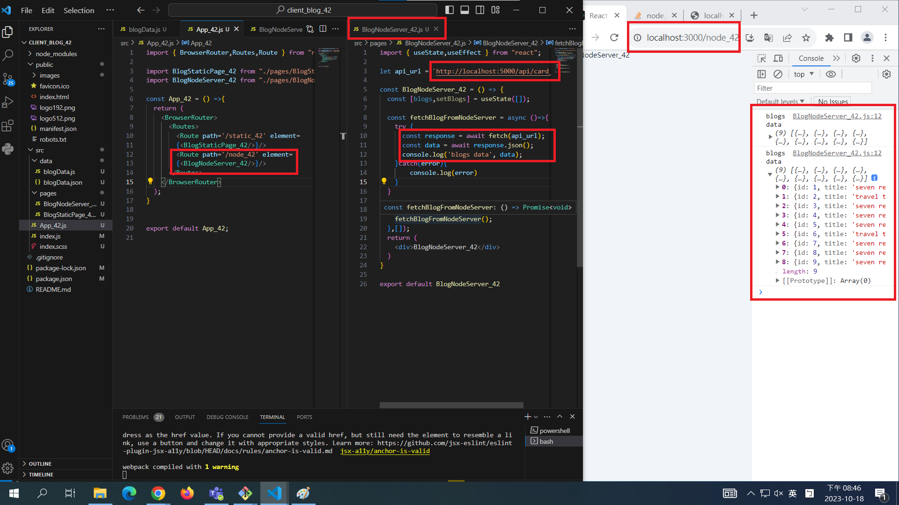

[My Github Repo URL](https://github.com/George0113/1121-wp1-demo-211410542.git)

### W06-P1: Run the server in W5 using /api/card_xx


```
93d9a14 George0113      Wed Oct 18 20:11:12 2023 +0800  W06-P1: Run the server in W5 using /api/card_xx
```

### W06-P2: blog html theme convert to React using scss


```
4d9f5c5 George0113      Wed Oct 18 19:23:25 2023 +0800  W06-P2: blog html theme convert to React using scss
```

### W06-P3: use route /static_xx to show <BlogStaticPage_xx />


```
f81c2c1 George0113      Wed Oct 18 20:05:13 2023 +0800  W06-P3: use route /static_xx to show <BlogStaticPage_xx />
```

### W06-P4: Fetch data from node server via route /node_xx, show data in console.log



```
debb251 George0113      Wed Oct 18 20:48:20 2023 +0800  W06-P4: Fetch data from node server via route /node_xx, show data in console.log
```

### W06-P5: Fetch data from node server via route /node_xx, render all blogs data in webpage


```
96a17f5 George0113      Wed Oct 18 21:22:23 2023 +0800  W06-P5: Fetch data from node server via route /node_xx, render all blogs data in webpage
```

### W06-P6: W6 all logs


```
$ git log --pretty=format:"%h%x09%an%x09%ad%x09%s" --after="2023-10-17"
96a17f5 George0113      Wed Oct 18 21:22:23 2023 +0800  W06-P5: Fetch data from node server via route /node_xx, render all blogs data in webpage
debb251 George0113      Wed Oct 18 20:48:20 2023 +0800  W06-P4: Fetch data from node server via route /node_xx, show data in console.log
93d9a14 George0113      Wed Oct 18 20:11:12 2023 +0800  W06-P1: Run the server in W5 using /api/card_xx
f81c2c1 George0113      Wed Oct 18 20:05:13 2023 +0800  W06-P3: use route /static_xx to show <BlogStaticPage_xx />
4d9f5c5 George0113      Wed Oct 18 19:23:25 2023 +0800  W06-P2: blog html theme convert to React using scss
c64474d George0113      Wed Oct 18 18:15:49 2023 +0800  new
```
