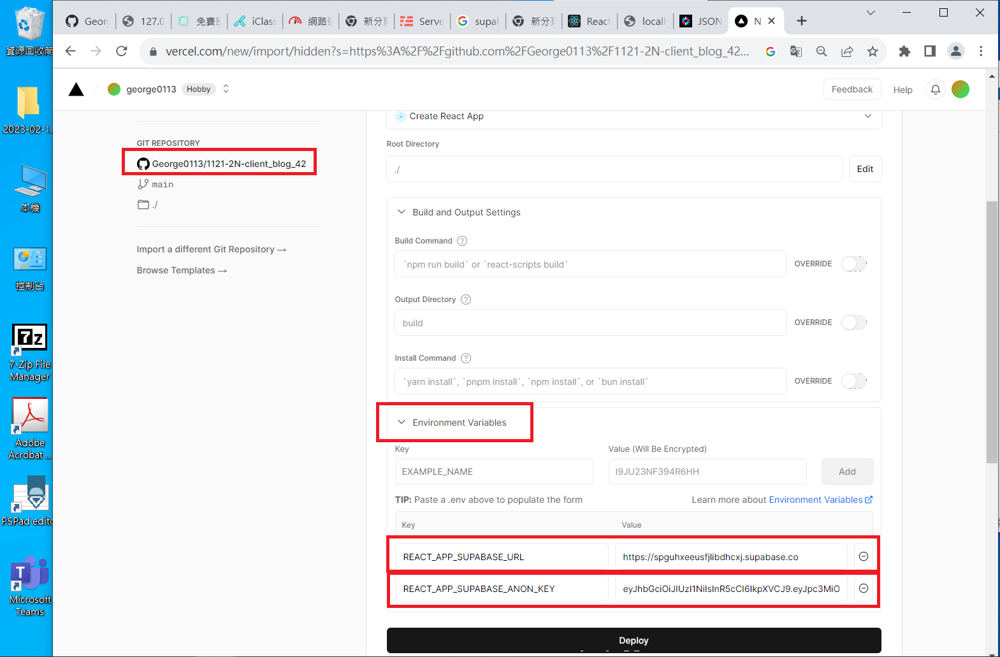

[My Github Repo URL](https://github.com/George0113/1121-wp1-demo-211410542.git)

### W07-P1: jwt introduction using anon key in Supabase


```
fd6cfef George0113      Wed Oct 25 20:01:18 2023 +0800   W07-P1: jwt introduction using anon key in Supabase
```

### W07-P2: Fetch blog data from Supabase


```
6108d32 George0113      Wed Oct 25 20:02:11 2023 +0800  W07-P2: Fetch blog data from Supabase
```

### W07-P3: Deploy to vercel, using /supa_xx to get blogs from Supabase

[Vercel URL](https://1121-2-n-client-blog-42.vercel.app/supa_42)




```

```

### W07-P4: W7 all logs

```
$ git log --pretty=format:"%h%x09%an%x09%ad%x09%s" --after="2023-10-24"

```
