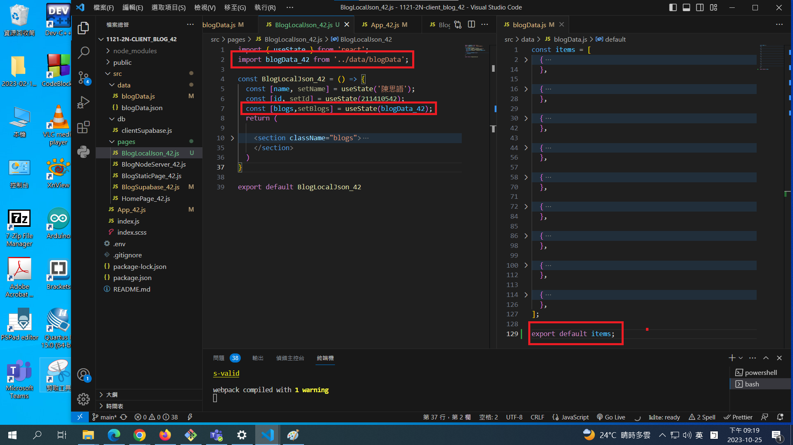

[My Github Repo URL](https://github.com/George0113/1121-wp1-demo-211410542.git)

### W07-P1: jwt introduction using anon key in Supabase


```
fd6cfef George0113      Wed Oct 25 20:01:18 2023 +0800   W07-P1: jwt introduction using anon key in Supabase
```

### W07-P2: Fetch blog data from Supabase


```
6108d32 George0113      Wed Oct 25 20:02:11 2023 +0800  W07-P2: Fetch blog data from Supabase
```

### W07-P3: Deploy to vercel, using /supa_xx to get blogs from Supabase

[Vercel URL](https://1121-2-n-client-blog-42.vercel.app/supa_42)


```
583eb31 George0113      Wed Oct 25 20:51:08 2023 +0800  W07-P3: Deploy to vercel, using /supa_xx to get blogs from Supabase
```

### W07-P4: Implement BlogLocalJson_xx.js to fetch blogs from json data




```
9c81b6d George0113      Wed Oct 25 21:29:48 2023 +0800  W07-P4: Implement BlogLocalJson_xx.js to fetch blogs from json data
```

### W07-P5: W7 all logs


```
$ git log --pretty=format:"%h%x09%an%x09%ad%x09%s" --after="2023-10-24"
9c81b6d George0113      Wed Oct 25 21:29:48 2023 +0800  W07-P4: Implement BlogLocalJson_xx.js to fetch blogs from json data
d0ed4ec George0113      Wed Oct 25 21:28:33 2023 +0800  W07-P3: Deploy to vercel, using /supa_xx to get blogs from Supabase
583eb31 George0113      Wed Oct 25 20:51:08 2023 +0800  W07-P3: Deploy to vercel, using /supa_xx to get blogs from Supabase
6108d32 George0113      Wed Oct 25 20:02:11 2023 +0800  W07-P2: Fetch blog data from Supabase
fd6cfef George0113      Wed Oct 25 20:01:18 2023 +0800   W07-P1: jwt introduction using anon key in Supabase
1580ff2 George0113      Wed Oct 25 19:16:06 2023 +0800   W07-P1: jwt introduction using anon key in Supabase
09ca699 George0113      Wed Oct 25 18:20:14 2023 +0800  new

```
